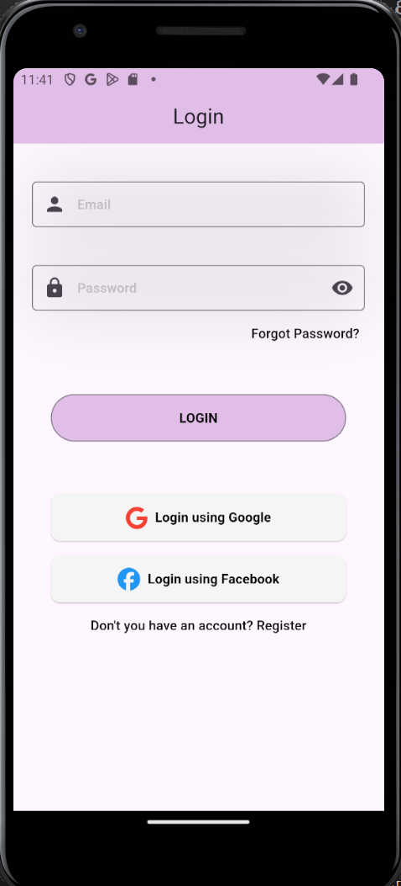
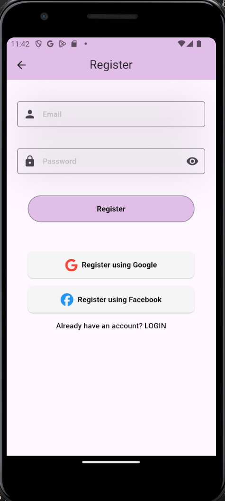
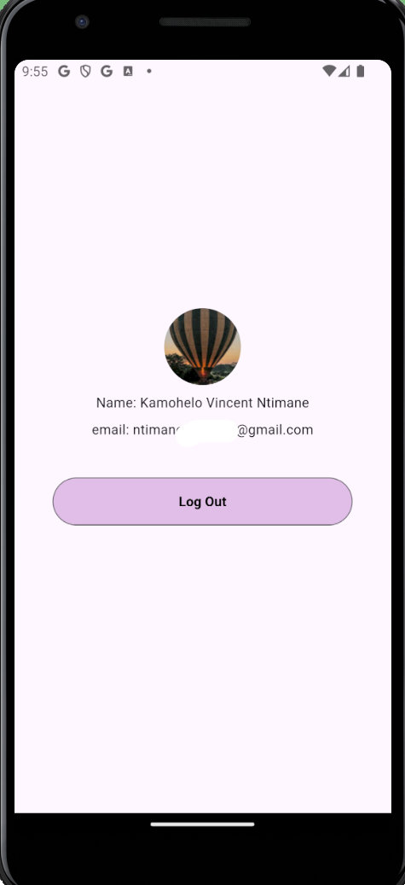

# register-login
A user must be able to register and login. (BoilerPlate)

## Login Screen UI

## Register Screen UI

## Home Screen UI
-Once a user signs in either using their google account or email&password to login
-I used provider to dispaly the users details on the home screen.

